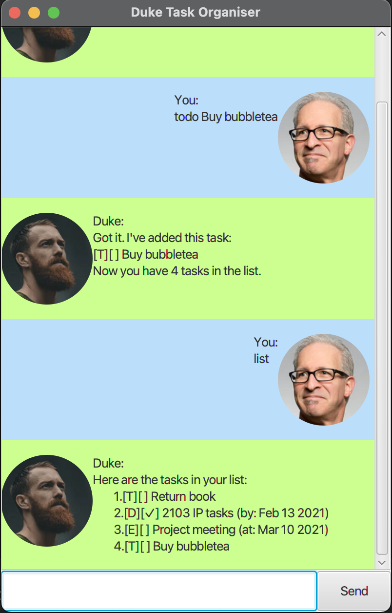

# User Guide

## QuickStart
This is a GUI task organiser which you can use to keep track of tasks you want to
complete. It contains several features such as adding different types of tasks, delete, update and even searching. The program is able to handle erroneous inputs and will be responded in red by 'Duke'. Tasks added or deleted will be updated and stored in a text file, which will be accessed by Duke on the next start up.

## 1.Features 

### 1.1 Add a To-Do

#### `todo` - adds a To-Do task

Adds a To-Do task to the task list.

Example of usage: 

`todo Borrow Book`

Expected outcome:

`[T][] Borrow Book`

### 1.2 Add an Event

#### `event` - adds a Event task

Adds an Event task to the task list with a yyyy-mm-dd date format.

Example of usage:

`event Borrow Book /at 2021-02-10`

Expected outcome:

`[E][] Borrow Book (at: Feb 10 2021)`

### 1.3 Add a Deadline

#### `deadline` - adds a Deadline task

Adds an Deadline task to the task list with a yyyy-mm-dd date format.

Example of usage:

`deadline Borrow Book /by 2021-02-10`

Expected outcome:

`[D][] Borrow Book (by: Feb 10 2021)`

### 1.4 List all tasks

#### `list` - lists all tasks in the task list

Lists all tasks in the task list in numeric order.

Example of usage:

`list`

Expected outcome:

>1. [T][ ] Borrow Book
>2. [E][ ] Borrow Book (at: Feb 10 2021)
>3. [D][ ] Borrow Book (by: Feb 10 2021)

### 1.5 Delete a task

#### `delete` - deletes a task

Deletes a task based on the index given in the list.

Example of usage:

`delete 1`

Expected outcome:

> Noted. I've removed this task:
>
> [T][] Borrow Book

### 1.6 Mark as done

#### `done` - marks a task as done

Marks a task as done based on the index given in the list.

Example of usage:

`done 1`

Expected outcome:

> [T][✓] Borrow Book

### 1.7 Finds task

#### `find` - finds tasks

Finds task in the list given a search query.

Example of usage:

`find borrow` or `find book`

Expected outcome:

`1. [T][✓] Borrow Book`

### 1.8 Update a task

#### `update` - update a specific task

Updates a chosen task without deleting it. 

Example of usage:

`update 1 todo hello`

Expected outcome:

`1. [T][] hello`

### 1.9 Exit

#### `bye` - say goodbye to Duke

Says goodbye to duke.

Example of usage:

`bye`

Expected outcome:

`Bye. Hope to see you again!`

